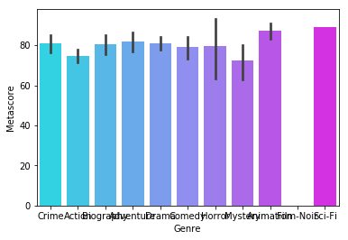

```python
import numpy as np
import pandas as pd
import matplotlib.pyplot as plt
%matplotlib inline
```


```python
chisquare = np.random.chisquare(2, 100)
mean = chisquare.mean()
std = chisquare.std()

print(mean)
print(std)

plt.hist(chisquare, color='c')
plt.axvline(mean, color='b', linestyle='solid', linewidth=2)
plt.axvline(mean + std, color='b', linestyle='dashed', linewidth=2)
plt.axvline(mean - std, color='b', linestyle='dashed', linewidth=2)
plt.show()
```

    1.915225828962688
    1.8001034603473516


# Chisquare
The mean and standard deviation for this distribution are not helpful in illustrating the characteristics of the distribution.


```python
negative_binomial = np.random.negative_binomial(3, 0.5, 100)
mean = negative_binomial.mean()
std = negative_binomial.std()

print(mean)
print(std)

plt.hist(negative_binomial, color='c')
plt.axvline(mean, color='b', linestyle='solid', linewidth=2)
plt.axvline(mean + std, color='b', linestyle='dashed', linewidth=2)
plt.axvline(mean - std, color='b', linestyle='dashed', linewidth=2)
plt.show()
```

    2.95
    2.2643983748448506


# Negative Binomial
The mean and standard deviation for this distribution are not helpful in illustrating the characteristics of the distribution.


```python
pareto = np.random.pareto(5, 100)
mean = pareto.mean()
std = pareto.std()

print(mean)
print(std)

plt.hist(pareto, color='c')
plt.axvline(mean, color='b', linestyle='solid', linewidth=2)
plt.axvline(mean + std, color='b', linestyle='dashed', linewidth=2)
plt.axvline(mean - std, color='b', linestyle='dashed', linewidth=2)
plt.show()
```

    0.26848084371250663
    0.34474720195104824


## Pareto
The mean and standard deviation for this distribution are not helpful in illustrating the characteristics of the distribution.


```python
uniform = np.random.uniform(2, 20, 100)
mean = uniform.mean()
std = uniform.std()

print(mean)
print(std)

plt.hist(uniform, color='c')
plt.axvline(mean, color='b', linestyle='solid', linewidth=2)
plt.axvline(mean + std, color='b', linestyle='dashed', linewidth=2)
plt.axvline(mean - std, color='b', linestyle='dashed', linewidth=2)
plt.show()
```

    10.822541997646574
    5.078505204590564


## Uniform
The mean for this distribution does help in illustrating the central tendecny of the distribution. However the standard deviation does not help in illustrating the deviation of the data. 


```python
wald = np.random.wald(1, 1, 100)
mean = wald.mean()
std = wald.std()

print(mean)
print(std)

plt.hist(wald, color='c')
plt.axvline(mean, color='b', linestyle='solid', linewidth=2)
plt.axvline(mean + std, color='b', linestyle='dashed', linewidth=2)
plt.axvline(mean - std, color='b', linestyle='dashed', linewidth=2)
plt.show()
```

    1.1190023554288822
    1.1832542872304388


## Wald
The mean and standard deviation for this distribution are not helpful in illustrating the characteristics of the distribution.


```python
triangular = np.random.triangular(0, 8, 10, 100)
mean = triangular.mean()
std = triangular.std()

print(mean)
print(std)

plt.hist(triangular, color='c')
plt.axvline(mean, color='b', linestyle='solid', linewidth=2)
plt.axvline(mean + std, color='b', linestyle='dashed', linewidth=2)
plt.axvline(mean - std, color='b', linestyle='dashed', linewidth=2)
plt.show()
```

    5.943189061696151
    2.1727284487190954


## Triangular
The mean for this distribution does help in illustrating the central tendecny of the distribution. The standard deviation is somewhat helpful in illustrating the deviation of the data, but it is not to be precise. 


```python
norm1 = np.random.normal(5, 0.5, 100)
norm2 = np.random.normal(10, 1, 100)
norm3 = norm1 + norm2

plt.hist(norm3, color='c')
plt.axvline(norm3.mean(), color='b', linestyle='solid', linewidth=2)
plt.axvline(norm3.mean() + norm3.std(), color='b', linestyle='dashed', linewidth=2)
plt.axvline(norm3.mean() - norm3.std(), color='b', linestyle='dashed', linewidth=2)
plt.show()
```





## Normal + Normal = Normal
The mean and the standard deviation for the data is useful in illustrating the central tendency and deviation. 
