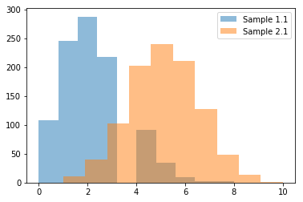
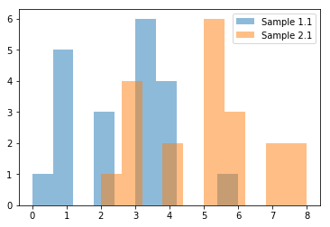
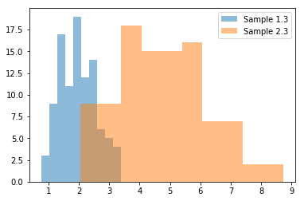

```python
import numpy as np
import pandas as pd
import scipy
import matplotlib.pyplot as plt
%matplotlib inline
```


```python
pop1 = np.random.binomial(10, 0.2, 10000)
pop2 = np.random.binomial(10, 0.5, 10000)

sample1 = np.random.choice(pop1, 100, replace=True)
sample2 = np.random.choice(pop2, 100, replace=True)

print(sample1.mean())
print(sample2.mean())
print(sample1.std())
print(sample2.std())
```

    2.13
    5.13
    1.4188375523646108
    1.5852760012060991


```python
sample1_1 = np.random.choice(pop1, 1000, replace=True)
sample2_1 = np.random.choice(pop2, 1000, replace=True)

print(sample1_1.mean())
print(sample2_1.mean())
print(sample1_1.std())
print(sample2_1.std())

plt.hist(sample1_1, alpha=0.5, label='Sample 1.1')
plt.hist(sample2_1, alpha=0.5, label='Sample 2.1')
plt.legend(loc='upper right')
plt.show()
```

    2.104
    5.099
    1.3569023546298384
    1.5953679826297131





```python
sample1_1 = np.random.choice(pop1, 20, replace=True)
sample2_1 = np.random.choice(pop2, 20, replace=True)

print(sample1_1.mean())
print(sample2_1.mean())
print(sample1_1.std())
print(sample2_1.std())

plt.hist(sample1_1, alpha=0.5, label='Sample 1.1')
plt.hist(sample2_1, alpha=0.5, label='Sample 2.1')
plt.legend(loc='upper right')
plt.show()
```

    2.55
    5.0
    1.4309088021254184
    1.6733200530681511





```python
pop1_2 = np.random.binomial(10, 0.3, 10000)
pop2_2 = np.random.binomial(10, 0.5, 10000)

sample1_2 = np.random.choice(pop1_2, 100, replace=True)
sample2_2 = np.random.choice(pop2_2, 100, replace=True)

from scipy.stats import ttest_ind
print(ttest_ind(sample2_2, sample1_2, equal_var=False))
```

    Ttest_indResult(statistic=11.202786683355539, pvalue=1.3987954375487556e-22)


```python
pop1_2 = np.random.binomial(10, 0.4, 10000)
pop2_2 = np.random.binomial(10, 0.5, 10000)

sample1_2 = np.random.choice(pop1_2, 100, replace=True)
sample2_2 = np.random.choice(pop2_2, 100, replace=True)

from scipy.stats import ttest_ind
print(ttest_ind(sample2_2, sample1_2, equal_var=False))
```

    Ttest_indResult(statistic=3.9294089482483274, pvalue=0.0001176178856867477)


```python
pop1_3 = np.random.gamma(10, 0.2, 10000)
pop2_3 = np.random.gamma(10, 0.5, 10000)

sample1_3 = np.random.choice(pop1_3, 100, replace=True)
sample2_3 = np.random.choice(pop2_3, 100, replace=True)

print(sample1.mean())
print(sample2.mean())
print(sample1.std())
print(sample2.std())
from scipy.stats import ttest_ind
print(ttest_ind(sample2_3, sample1_3, equal_var=False))

plt.hist(sample1_3, alpha=0.5, label='Sample 1.3')
plt.hist(sample2_3, alpha=0.5, label='Sample 2.3')
plt.legend(loc='upper right')
plt.show()
```

    2.13
    5.13
    1.4188375523646108
    1.5852760012060991
    Ttest_indResult(statistic=17.486810541854247, pvalue=9.978042605604924e-36)





```python

```
