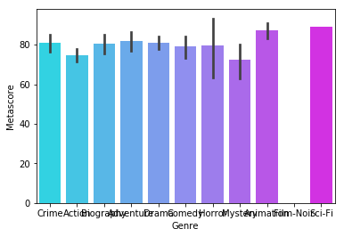

```python
import numpy as np
import pandas as pd
import matplotlib.pyplot as plt
import seaborn as sns
%matplotlib inline
```


```python
top_movies = pd.read_csv('IMDB_Top250.csv')
```


```python
top_movies
```


<div>
<style scoped>
    .dataframe tbody tr th:only-of-type {
        vertical-align: middle;
    }

    .dataframe tbody tr th {
        vertical-align: top;
    }

    .dataframe thead th {
        text-align: right;
    }
</style>
<table border="1" class="dataframe">
  <thead>
    <tr style="text-align: right;">
      <th></th>
      <th>Position</th>
      <th>Title</th>
      <th>Year</th>
      <th>Rated</th>
      <th>Released</th>
      <th>Runtime</th>
      <th>Genre</th>
      <th>Director</th>
      <th>Language</th>
      <th>Country</th>
      <th>Awards</th>
      <th>Ratings.Value</th>
      <th>Metascore</th>
      <th>imdbRating</th>
      <th>imdbVotes</th>
      <th>BoxOffice</th>
      <th>Production</th>
      <th>Genre2</th>
      <th>Genre3</th>
    </tr>
  </thead>
  <tbody>
    <tr>
      <th>0</th>
      <td>1</td>
      <td>The Shawshank Redemption</td>
      <td>1994</td>
      <td>R</td>
      <td>14-Oct-94</td>
      <td>142 min</td>
      <td>Crime</td>
      <td>Frank Darabont</td>
      <td>English</td>
      <td>USA</td>
      <td>Nominated for 7 Oscars. Another 19 wins &amp; 30 n...</td>
      <td>9.3/10</td>
      <td>80.0</td>
      <td>9.3</td>
      <td>1,825,626</td>
      <td>NaN</td>
      <td>Columbia Pictures</td>
      <td>Drama</td>
      <td>NaN</td>
    </tr>
    <tr>
      <th>1</th>
      <td>2</td>
      <td>The Godfather</td>
      <td>1972</td>
      <td>R</td>
      <td>24-Mar-72</td>
      <td>175 min</td>
      <td>Crime</td>
      <td>Francis Ford Coppola</td>
      <td>English, Italian, Latin</td>
      <td>USA</td>
      <td>Won 3 Oscars. Another 23 wins &amp; 27 nominations.</td>
      <td>9.2/10</td>
      <td>100.0</td>
      <td>9.2</td>
      <td>1,243,444</td>
      <td>NaN</td>
      <td>Paramount Pictures</td>
      <td>Drama</td>
      <td>NaN</td>
    </tr>
    <tr>
      <th>2</th>
      <td>3</td>
      <td>The Godfather: Part II</td>
      <td>1974</td>
      <td>R</td>
      <td>20-Dec-74</td>
      <td>202 min</td>
      <td>Crime</td>
      <td>Francis Ford Coppola</td>
      <td>English, Italian, Spanish, Latin, Sicilian</td>
      <td>USA</td>
      <td>Won 6 Oscars. Another 10 wins &amp; 20 nominations.</td>
      <td>9.0/10</td>
      <td>85.0</td>
      <td>9.0</td>
      <td>856,870</td>
      <td>NaN</td>
      <td>Paramount Pictures</td>
      <td>Drama</td>
      <td>NaN</td>
    </tr>
    <tr>
      <th>3</th>
      <td>4</td>
      <td>The Dark Knight</td>
      <td>2008</td>
      <td>PG-13</td>
      <td>18-Jul-08</td>
      <td>152 min</td>
      <td>Action</td>
      <td>Christopher Nolan</td>
      <td>English, Mandarin</td>
      <td>USA, UK</td>
      <td>Won 2 Oscars. Another 151 wins &amp; 153 nominations.</td>
      <td>9.0/10</td>
      <td>82.0</td>
      <td>9.0</td>
      <td>1,802,351</td>
      <td>$533,316,061</td>
      <td>Warner Bros. Pictures/Legendary</td>
      <td>Crime</td>
      <td>Drama</td>
    </tr>
    <tr>
      <th>4</th>
      <td>5</td>
      <td>12 Angry Men</td>
      <td>1957</td>
      <td>APPROVED</td>
      <td>1-Apr-57</td>
      <td>96 min</td>
      <td>Crime</td>
      <td>Sidney Lumet</td>
      <td>English</td>
      <td>USA</td>
      <td>Nominated for 3 Oscars. Another 16 wins &amp; 8 no...</td>
      <td>8.9/10</td>
      <td>96.0</td>
      <td>8.9</td>
      <td>494,215</td>
      <td>NaN</td>
      <td>Criterion Collection</td>
      <td>Drama</td>
      <td>NaN</td>
    </tr>
    <tr>
      <th>5</th>
      <td>6</td>
      <td>Schindler's List</td>
      <td>1993</td>
      <td>R</td>
      <td>4-Feb-94</td>
      <td>195 min</td>
      <td>Biography</td>
      <td>Steven Spielberg</td>
      <td>English, Hebrew, German, Polish</td>
      <td>USA</td>
      <td>Won 7 Oscars. Another 71 wins &amp; 33 nominations.</td>
      <td>8.9/10</td>
      <td>93.0</td>
      <td>8.9</td>
      <td>937,837</td>
      <td>NaN</td>
      <td>Universal Pictures</td>
      <td>Drama</td>
      <td>History</td>
    </tr>
    <tr>
      <th>6</th>
      <td>7</td>
      <td>The Lord of the Rings: The Return of the King</td>
      <td>2003</td>
      <td>PG-13</td>
      <td>17-Dec-03</td>
      <td>201 min</td>
      <td>Adventure</td>
      <td>Peter Jackson</td>
      <td>English, Quenya, Old English, Sindarin</td>
      <td>USA, New Zealand</td>
      <td>Won 11 Oscars. Another 197 wins &amp; 122 nominati...</td>
      <td>8.9/10</td>
      <td>94.0</td>
      <td>8.9</td>
      <td>1,304,569</td>
      <td>$364,000,000</td>
      <td>New Line Cinema</td>
      <td>Drama</td>
      <td>Fantasy</td>
    </tr>
    <tr>
      <th>7</th>
      <td>8</td>
      <td>Pulp Fiction</td>
      <td>1994</td>
      <td>R</td>
      <td>14-Oct-94</td>
      <td>154 min</td>
      <td>Crime</td>
      <td>Quentin Tarantino</td>
      <td>English, Spanish, French</td>
      <td>USA</td>
      <td>Won 1 Oscar. Another 60 wins &amp; 68 nominations.</td>
      <td>8.9/10</td>
      <td>94.0</td>
      <td>8.9</td>
      <td>1,427,451</td>
      <td>NaN</td>
      <td>Miramax Films</td>
      <td>Drama</td>
      <td>NaN</td>
    </tr>
    <tr>
      <th>8</th>
      <td>9</td>
      <td>Fight Club</td>
      <td>1999</td>
      <td>R</td>
      <td>15-Oct-99</td>
      <td>139 min</td>
      <td>Drama</td>
      <td>David Fincher</td>
      <td>English</td>
      <td>USA, Germany</td>
      <td>Nominated for 1 Oscar. Another 10 wins &amp; 31 no...</td>
      <td>8.8/10</td>
      <td>66.0</td>
      <td>8.8</td>
      <td>1,458,676</td>
      <td>NaN</td>
      <td>20th Century Fox</td>
      <td>NaN</td>
      <td>NaN</td>
    </tr>
    <tr>
      <th>9</th>
      <td>10</td>
      <td>The Lord of the Rings: The Fellowship of the Ring</td>
      <td>2001</td>
      <td>PG-13</td>
      <td>19-Dec-01</td>
      <td>178 min</td>
      <td>Adventure</td>
      <td>Peter Jackson</td>
      <td>English, Sindarin</td>
      <td>New Zealand, USA</td>
      <td>Won 4 Oscars. Another 113 wins &amp; 124 nominations.</td>
      <td>8.8/10</td>
      <td>92.0</td>
      <td>8.8</td>
      <td>1,326,876</td>
      <td>$314,000,000</td>
      <td>New Line Cinema</td>
      <td>Drama</td>
      <td>Fantasy</td>
    </tr>
    <tr>
      <th>10</th>
      <td>11</td>
      <td>Forrest Gump</td>
      <td>1994</td>
      <td>PG-13</td>
      <td>6-Jul-94</td>
      <td>142 min</td>
      <td>Comedy</td>
      <td>Robert Zemeckis</td>
      <td>English</td>
      <td>USA</td>
      <td>Won 6 Oscars. Another 39 wins &amp; 66 nominations.</td>
      <td>8.8/10</td>
      <td>82.0</td>
      <td>8.8</td>
      <td>1,365,937</td>
      <td>$405,000</td>
      <td>Paramount Pictures</td>
      <td>Drama</td>
      <td>Romance</td>
    </tr>
    <tr>
      <th>11</th>
      <td>12</td>
      <td>Star Wars: Episode V - The Empire Strikes Back</td>
      <td>1980</td>
      <td>PG</td>
      <td>20-Jun-80</td>
      <td>124 min</td>
      <td>Action</td>
      <td>Irvin Kershner</td>
      <td>English</td>
      <td>USA</td>
      <td>Won 1 Oscar. Another 21 wins &amp; 19 nominations.</td>
      <td>8.8/10</td>
      <td>81.0</td>
      <td>8.8</td>
      <td>910,608</td>
      <td>$4,548,170</td>
      <td>Twentieth Century Fox</td>
      <td>Adventure</td>
      <td>Fantasy</td>
    </tr>
    <tr>
      <th>12</th>
      <td>13</td>
      <td>Inception</td>
      <td>2010</td>
      <td>PG-13</td>
      <td>16-Jul-10</td>
      <td>148 min</td>
      <td>Action</td>
      <td>Christopher Nolan</td>
      <td>English, Japanese, French</td>
      <td>USA, UK</td>
      <td>Won 4 Oscars. Another 150 wins &amp; 203 nominations.</td>
      <td>8.8/10</td>
      <td>74.0</td>
      <td>8.8</td>
      <td>1,592,306</td>
      <td>$292,568,851</td>
      <td>Warner Bros. Pictures</td>
      <td>Adventure</td>
      <td>Sci-Fi</td>
    </tr>
    <tr>
      <th>13</th>
      <td>14</td>
      <td>The Lord of the Rings: The Two Towers</td>
      <td>2002</td>
      <td>PG-13</td>
      <td>18-Dec-02</td>
      <td>179 min</td>
      <td>Adventure</td>
      <td>Peter Jackson</td>
      <td>English, Sindarin, Old English</td>
      <td>USA, New Zealand</td>
      <td>Won 2 Oscars. Another 118 wins &amp; 138 nominations.</td>
      <td>8.7/10</td>
      <td>88.0</td>
      <td>8.7</td>
      <td>1,188,300</td>
      <td>$339,700,000</td>
      <td>New Line Cinema</td>
      <td>Drama</td>
      <td>Fantasy</td>
    </tr>
    <tr>
      <th>14</th>
      <td>15</td>
      <td>One Flew Over the Cuckoo's Nest</td>
      <td>1975</td>
      <td>R</td>
      <td>19-Nov-75</td>
      <td>133 min</td>
      <td>Drama</td>
      <td>Milos Forman</td>
      <td>English</td>
      <td>USA</td>
      <td>Won 5 Oscars. Another 30 wins &amp; 13 nominations.</td>
      <td>8.7/10</td>
      <td>80.0</td>
      <td>8.7</td>
      <td>729,653</td>
      <td>NaN</td>
      <td>United Artists</td>
      <td>NaN</td>
      <td>NaN</td>
    </tr>
    <tr>
      <th>15</th>
      <td>16</td>
      <td>Goodfellas</td>
      <td>1990</td>
      <td>R</td>
      <td>21-Sep-90</td>
      <td>146 min</td>
      <td>Crime</td>
      <td>Martin Scorsese</td>
      <td>English, Italian</td>
      <td>USA</td>
      <td>Won 1 Oscar. Another 37 wins &amp; 35 nominations.</td>
      <td>8.7/10</td>
      <td>89.0</td>
      <td>8.7</td>
      <td>787,997</td>
      <td>NaN</td>
      <td>Warner Bros.</td>
      <td>Drama</td>
      <td>NaN</td>
    </tr>
    <tr>
      <th>16</th>
      <td>17</td>
      <td>The Matrix</td>
      <td>1999</td>
      <td>R</td>
      <td>31-Mar-99</td>
      <td>136 min</td>
      <td>Action</td>
      <td>Lana Wachowski, Lilly Wachowski</td>
      <td>English</td>
      <td>USA</td>
      <td>Won 4 Oscars. Another 34 wins &amp; 45 nominations.</td>
      <td>8.7/10</td>
      <td>73.0</td>
      <td>8.7</td>
      <td>1,314,628</td>
      <td>NaN</td>
      <td>Warner Bros. Pictures</td>
      <td>Sci-Fi</td>
      <td>NaN</td>
    </tr>
    <tr>
      <th>17</th>
      <td>18</td>
      <td>Star Wars: Episode IV - A New Hope</td>
      <td>1977</td>
      <td>PG</td>
      <td>25-May-77</td>
      <td>121 min</td>
      <td>Action</td>
      <td>George Lucas</td>
      <td>English</td>
      <td>USA</td>
      <td>Won 6 Oscars. Another 50 wins &amp; 28 nominations.</td>
      <td>8.7/10</td>
      <td>92.0</td>
      <td>8.7</td>
      <td>982,688</td>
      <td>NaN</td>
      <td>20th Century Fox</td>
      <td>Adventure</td>
      <td>Fantasy</td>
    </tr>
    <tr>
      <th>18</th>
      <td>19</td>
      <td>Se7en</td>
      <td>1995</td>
      <td>R</td>
      <td>22-Sep-95</td>
      <td>127 min</td>
      <td>Crime</td>
      <td>David Fincher</td>
      <td>English</td>
      <td>USA</td>
      <td>Nominated for 1 Oscar. Another 25 wins &amp; 34 no...</td>
      <td>8.6/10</td>
      <td>65.0</td>
      <td>8.6</td>
      <td>1,108,627</td>
      <td>NaN</td>
      <td>New Line Cinema</td>
      <td>Drama</td>
      <td>Mystery</td>
    </tr>
    <tr>
      <th>19</th>
      <td>20</td>
      <td>It's a Wonderful Life</td>
      <td>1946</td>
      <td>PG</td>
      <td>7-Jan-47</td>
      <td>130 min</td>
      <td>Drama</td>
      <td>Frank Capra</td>
      <td>English</td>
      <td>USA</td>
      <td>Nominated for 5 Oscars. Another 6 wins &amp; 1 nom...</td>
      <td>8.6/10</td>
      <td>89.0</td>
      <td>8.6</td>
      <td>301,614</td>
      <td>NaN</td>
      <td>Liberty Films</td>
      <td>Family</td>
      <td>Fantasy</td>
    </tr>
    <tr>
      <th>20</th>
      <td>21</td>
      <td>The Silence of the Lambs</td>
      <td>1991</td>
      <td>R</td>
      <td>14-Feb-91</td>
      <td>118 min</td>
      <td>Crime</td>
      <td>Jonathan Demme</td>
      <td>English</td>
      <td>USA</td>
      <td>Won 5 Oscars. Another 49 wins &amp; 37 nominations.</td>
      <td>8.6/10</td>
      <td>84.0</td>
      <td>8.6</td>
      <td>967,878</td>
      <td>NaN</td>
      <td>Orion Pictures Corporation</td>
      <td>Drama</td>
      <td>Thriller</td>
    </tr>
    <tr>
      <th>21</th>
      <td>22</td>
      <td>The Usual Suspects</td>
      <td>1995</td>
      <td>R</td>
      <td>15-Sep-95</td>
      <td>106 min</td>
      <td>Crime</td>
      <td>Bryan Singer</td>
      <td>English, Hungarian, Spanish, French</td>
      <td>USA, Germany</td>
      <td>Won 2 Oscars. Another 32 wins &amp; 16 nominations.</td>
      <td>8.6/10</td>
      <td>77.0</td>
      <td>8.6</td>
      <td>797,545</td>
      <td>NaN</td>
      <td>Gramercy Pictures</td>
      <td>Drama</td>
      <td>Mystery</td>
    </tr>
    <tr>
      <th>22</th>
      <td>23</td>
      <td>Léon: The Professional</td>
      <td>1994</td>
      <td>R</td>
      <td>18-Nov-94</td>
      <td>110 min</td>
      <td>Crime</td>
      <td>Luc Besson</td>
      <td>English, Italian, French</td>
      <td>France</td>
      <td>5 wins &amp; 11 nominations.</td>
      <td>8.6/10</td>
      <td>64.0</td>
      <td>8.6</td>
      <td>787,281</td>
      <td>NaN</td>
      <td>Columbia Pictures</td>
      <td>Drama</td>
      <td>Thriller</td>
    </tr>
    <tr>
      <th>23</th>
      <td>24</td>
      <td>Saving Private Ryan</td>
      <td>1998</td>
      <td>R</td>
      <td>24-Jul-98</td>
      <td>169 min</td>
      <td>Drama</td>
      <td>Steven Spielberg</td>
      <td>English, French, German, Czech</td>
      <td>USA</td>
      <td>Won 5 Oscars. Another 74 wins &amp; 74 nominations.</td>
      <td>8.6/10</td>
      <td>90.0</td>
      <td>8.6</td>
      <td>960,639</td>
      <td>NaN</td>
      <td>Paramount Pictures</td>
      <td>War</td>
      <td>NaN</td>
    </tr>
    <tr>
      <th>24</th>
      <td>25</td>
      <td>City Lights</td>
      <td>1931</td>
      <td>G</td>
      <td>7-Mar-31</td>
      <td>87 min</td>
      <td>Comedy</td>
      <td>Charles Chaplin</td>
      <td>English</td>
      <td>USA</td>
      <td>3 wins.</td>
      <td>8.6/10</td>
      <td>NaN</td>
      <td>8.6</td>
      <td>119,453</td>
      <td>NaN</td>
      <td>Twentieth Century Fox Home Entertainment</td>
      <td>Drama</td>
      <td>Romance</td>
    </tr>
    <tr>
      <th>25</th>
      <td>26</td>
      <td>Interstellar</td>
      <td>2014</td>
      <td>PG-13</td>
      <td>7-Nov-14</td>
      <td>169 min</td>
      <td>Adventure</td>
      <td>Christopher Nolan</td>
      <td>English</td>
      <td>USA, UK, Canada, Iceland</td>
      <td>Won 1 Oscar. Another 41 wins &amp; 142 nominations.</td>
      <td>8.6/10</td>
      <td>74.0</td>
      <td>8.6</td>
      <td>1,057,411</td>
      <td>$158,737,441</td>
      <td>Paramount Pictures</td>
      <td>Drama</td>
      <td>Sci-Fi</td>
    </tr>
    <tr>
      <th>26</th>
      <td>27</td>
      <td>American History X</td>
      <td>1998</td>
      <td>R</td>
      <td>20-Nov-98</td>
      <td>119 min</td>
      <td>Crime</td>
      <td>Tony Kaye</td>
      <td>English</td>
      <td>USA</td>
      <td>Nominated for 1 Oscar. Another 4 wins &amp; 13 nom...</td>
      <td>8.5/10</td>
      <td>62.0</td>
      <td>8.5</td>
      <td>843,128</td>
      <td>NaN</td>
      <td>New Line Cinema</td>
      <td>Drama</td>
      <td>NaN</td>
    </tr>
    <tr>
      <th>27</th>
      <td>28</td>
      <td>Modern Times</td>
      <td>1936</td>
      <td>G</td>
      <td>25-Feb-36</td>
      <td>87 min</td>
      <td>Comedy</td>
      <td>Charles Chaplin</td>
      <td>English</td>
      <td>USA</td>
      <td>4 wins &amp; 1 nomination.</td>
      <td>8.5/10</td>
      <td>96.0</td>
      <td>8.5</td>
      <td>158,254</td>
      <td>NaN</td>
      <td>United Artists</td>
      <td>Drama</td>
      <td>Family</td>
    </tr>
    <tr>
      <th>28</th>
      <td>29</td>
      <td>Casablanca</td>
      <td>1942</td>
      <td>PG</td>
      <td>23-Jan-43</td>
      <td>102 min</td>
      <td>Drama</td>
      <td>Michael Curtiz</td>
      <td>English, French, German, Italian</td>
      <td>USA</td>
      <td>Won 3 Oscars. Another 5 wins &amp; 8 nominations.</td>
      <td>8.5/10</td>
      <td>100.0</td>
      <td>8.5</td>
      <td>415,400</td>
      <td>NaN</td>
      <td>Warner Bros. Pictures</td>
      <td>Romance</td>
      <td>War</td>
    </tr>
    <tr>
      <th>29</th>
      <td>30</td>
      <td>The Green Mile</td>
      <td>1999</td>
      <td>R</td>
      <td>10-Dec-99</td>
      <td>189 min</td>
      <td>Crime</td>
      <td>Frank Darabont</td>
      <td>English, French</td>
      <td>USA</td>
      <td>Nominated for 4 Oscars. Another 15 wins &amp; 30 n...</td>
      <td>8.5/10</td>
      <td>61.0</td>
      <td>8.5</td>
      <td>857,527</td>
      <td>NaN</td>
      <td>Warner Bros. Pictures</td>
      <td>Drama</td>
      <td>Fantasy</td>
    </tr>
    <tr>
      <th>...</th>
      <td>...</td>
      <td>...</td>
      <td>...</td>
      <td>...</td>
      <td>...</td>
      <td>...</td>
      <td>...</td>
      <td>...</td>
      <td>...</td>
      <td>...</td>
      <td>...</td>
      <td>...</td>
      <td>...</td>
      <td>...</td>
      <td>...</td>
      <td>...</td>
      <td>...</td>
      <td>...</td>
      <td>...</td>
    </tr>
    <tr>
      <th>220</th>
      <td>221</td>
      <td>Notorious</td>
      <td>1946</td>
      <td>APPROVED</td>
      <td>6-Sep-46</td>
      <td>101 min</td>
      <td>Drama</td>
      <td>Alfred Hitchcock</td>
      <td>English, French, Portuguese</td>
      <td>USA</td>
      <td>Nominated for 2 Oscars. Another 3 wins &amp; 1 nom...</td>
      <td>8.0/10</td>
      <td>NaN</td>
      <td>8.0</td>
      <td>77,339</td>
      <td>NaN</td>
      <td>RKO Radio Pictures</td>
      <td>Film-Noir</td>
      <td>Romance</td>
    </tr>
    <tr>
      <th>221</th>
      <td>222</td>
      <td>Harvey</td>
      <td>1950</td>
      <td>NOT RATED</td>
      <td>21-Dec-50</td>
      <td>104 min</td>
      <td>Comedy</td>
      <td>Henry Koster</td>
      <td>English, Spanish, Latin</td>
      <td>USA</td>
      <td>Won 1 Oscar. Another 1 win &amp; 4 nominations.</td>
      <td>8.0/10</td>
      <td>NaN</td>
      <td>8.0</td>
      <td>46,446</td>
      <td>NaN</td>
      <td>MCA Universal Home Video</td>
      <td>Drama</td>
      <td>Fantasy</td>
    </tr>
    <tr>
      <th>222</th>
      <td>223</td>
      <td>The Martian</td>
      <td>2015</td>
      <td>PG-13</td>
      <td>2-Oct-15</td>
      <td>144 min</td>
      <td>Adventure</td>
      <td>Ridley Scott</td>
      <td>English, Mandarin</td>
      <td>USA, UK</td>
      <td>Nominated for 7 Oscars. Another 34 wins &amp; 180 ...</td>
      <td>8.0/10</td>
      <td>80.0</td>
      <td>8.0</td>
      <td>560,864</td>
      <td>$202,313,768</td>
      <td>20th Century Fox</td>
      <td>Drama</td>
      <td>Sci-Fi</td>
    </tr>
    <tr>
      <th>223</th>
      <td>224</td>
      <td>The Exorcist</td>
      <td>1973</td>
      <td>R</td>
      <td>26-Dec-73</td>
      <td>122 min</td>
      <td>Horror</td>
      <td>William Friedkin</td>
      <td>English, Latin, Greek, French, German, Arabic,...</td>
      <td>USA</td>
      <td>Won 2 Oscars. Another 14 wins &amp; 15 nominations.</td>
      <td>8.0/10</td>
      <td>82.0</td>
      <td>8.0</td>
      <td>299,364</td>
      <td>NaN</td>
      <td>Warner Bros. Pictures</td>
      <td>NaN</td>
      <td>NaN</td>
    </tr>
    <tr>
      <th>224</th>
      <td>225</td>
      <td>Rio Bravo</td>
      <td>1959</td>
      <td>NOT RATED</td>
      <td>4-Apr-59</td>
      <td>141 min</td>
      <td>Action</td>
      <td>Howard Hawks</td>
      <td>English, Spanish</td>
      <td>USA</td>
      <td>Won 1 Golden Globe. Another 1 win &amp; 4 nominati...</td>
      <td>8.0/10</td>
      <td>NaN</td>
      <td>8.0</td>
      <td>45,629</td>
      <td>NaN</td>
      <td>Xenon</td>
      <td>Drama</td>
      <td>Western</td>
    </tr>
    <tr>
      <th>225</th>
      <td>226</td>
      <td>The Philadelphia Story</td>
      <td>1940</td>
      <td>NOT RATED</td>
      <td>17-Jan-41</td>
      <td>112 min</td>
      <td>Comedy</td>
      <td>George Cukor</td>
      <td>English, French</td>
      <td>USA</td>
      <td>Won 2 Oscars. Another 3 wins &amp; 5 nominations.</td>
      <td>8.0/10</td>
      <td>NaN</td>
      <td>8.0</td>
      <td>52,602</td>
      <td>NaN</td>
      <td>MGM</td>
      <td>Romance</td>
      <td>NaN</td>
    </tr>
    <tr>
      <th>226</th>
      <td>227</td>
      <td>Rope</td>
      <td>1948</td>
      <td>APPROVED</td>
      <td>25-Sep-48</td>
      <td>80 min</td>
      <td>Crime</td>
      <td>Alfred Hitchcock</td>
      <td>English</td>
      <td>USA</td>
      <td>3 nominations.</td>
      <td>8.0/10</td>
      <td>NaN</td>
      <td>8.0</td>
      <td>102,340</td>
      <td>NaN</td>
      <td>Warner Bros. Pictures</td>
      <td>Drama</td>
      <td>Thriller</td>
    </tr>
    <tr>
      <th>227</th>
      <td>228</td>
      <td>The Big Sleep</td>
      <td>1946</td>
      <td>APPROVED</td>
      <td>31-Aug-46</td>
      <td>114 min</td>
      <td>Crime</td>
      <td>Howard Hawks</td>
      <td>English</td>
      <td>USA</td>
      <td>2 wins.</td>
      <td>8.0/10</td>
      <td>NaN</td>
      <td>8.0</td>
      <td>67,315</td>
      <td>NaN</td>
      <td>Warner Bros. Pictures</td>
      <td>Film-Noir</td>
      <td>Mystery</td>
    </tr>
    <tr>
      <th>228</th>
      <td>229</td>
      <td>Pink Floyd: The Wall</td>
      <td>1982</td>
      <td>R</td>
      <td>17-Sep-82</td>
      <td>95 min</td>
      <td>Animation</td>
      <td>Alan Parker</td>
      <td>English</td>
      <td>UK</td>
      <td>Won 2 BAFTA Film Awards. Another 1 win &amp; 1 nom...</td>
      <td>8.0/10</td>
      <td>NaN</td>
      <td>8.0</td>
      <td>63,190</td>
      <td>NaN</td>
      <td>United Artists</td>
      <td>Drama</td>
      <td>Fantasy</td>
    </tr>
    <tr>
      <th>229</th>
      <td>230</td>
      <td>The King's Speech</td>
      <td>2010</td>
      <td>R</td>
      <td>25-Dec-10</td>
      <td>118 min</td>
      <td>Biography</td>
      <td>Tom Hooper</td>
      <td>English</td>
      <td>UK, USA, Australia</td>
      <td>Won 4 Oscars. Another 103 wins &amp; 194 nominations.</td>
      <td>8.0/10</td>
      <td>88.0</td>
      <td>8.0</td>
      <td>537,662</td>
      <td>$138,300,000</td>
      <td>The Weinstein Company</td>
      <td>Drama</td>
      <td>NaN</td>
    </tr>
    <tr>
      <th>230</th>
      <td>231</td>
      <td>A Christmas Story</td>
      <td>1983</td>
      <td>PG</td>
      <td>18-Nov-83</td>
      <td>94 min</td>
      <td>Comedy</td>
      <td>Bob Clark</td>
      <td>English</td>
      <td>USA, Canada</td>
      <td>3 wins &amp; 11 nominations.</td>
      <td>8.0/10</td>
      <td>77.0</td>
      <td>8.0</td>
      <td>110,893</td>
      <td>NaN</td>
      <td>MGM</td>
      <td>Family</td>
      <td>NaN</td>
    </tr>
    <tr>
      <th>231</th>
      <td>232</td>
      <td>The Graduate</td>
      <td>1967</td>
      <td>APPROVED</td>
      <td>22-Dec-67</td>
      <td>106 min</td>
      <td>Comedy</td>
      <td>Mike Nichols</td>
      <td>English</td>
      <td>USA</td>
      <td>Won 1 Oscar. Another 20 wins &amp; 16 nominations.</td>
      <td>8.0/10</td>
      <td>77.0</td>
      <td>8.0</td>
      <td>220,459</td>
      <td>NaN</td>
      <td>Embassy Pictures/Rialto Pictures</td>
      <td>Drama</td>
      <td>NaN</td>
    </tr>
    <tr>
      <th>232</th>
      <td>233</td>
      <td>JFK</td>
      <td>1991</td>
      <td>R</td>
      <td>20-Dec-91</td>
      <td>189 min</td>
      <td>Drama</td>
      <td>Oliver Stone</td>
      <td>English, Spanish</td>
      <td>France, USA</td>
      <td>Won 2 Oscars. Another 17 wins &amp; 25 nominations.</td>
      <td>8.0/10</td>
      <td>72.0</td>
      <td>8.0</td>
      <td>120,061</td>
      <td>NaN</td>
      <td>Warner Bros.</td>
      <td>History</td>
      <td>Thriller</td>
    </tr>
    <tr>
      <th>233</th>
      <td>234</td>
      <td>Sling Blade</td>
      <td>1996</td>
      <td>R</td>
      <td>14-Mar-97</td>
      <td>135 min</td>
      <td>Drama</td>
      <td>Billy Bob Thornton</td>
      <td>English</td>
      <td>USA</td>
      <td>Won 1 Oscar. Another 13 wins &amp; 15 nominations.</td>
      <td>8.0/10</td>
      <td>84.0</td>
      <td>8.0</td>
      <td>75,931</td>
      <td>NaN</td>
      <td>Miramax Films</td>
      <td>NaN</td>
      <td>NaN</td>
    </tr>
    <tr>
      <th>234</th>
      <td>235</td>
      <td>Blood Diamond</td>
      <td>2006</td>
      <td>R</td>
      <td>8-Dec-06</td>
      <td>143 min</td>
      <td>Adventure</td>
      <td>Edward Zwick</td>
      <td>English, Mende, Afrikaans</td>
      <td>Germany, USA</td>
      <td>Nominated for 5 Oscars. Another 8 wins &amp; 26 no...</td>
      <td>8.0/10</td>
      <td>64.0</td>
      <td>8.0</td>
      <td>424,781</td>
      <td>$57,300,000</td>
      <td>Warner Bros. Pictures</td>
      <td>Drama</td>
      <td>Thriller</td>
    </tr>
    <tr>
      <th>235</th>
      <td>236</td>
      <td>Magnolia</td>
      <td>1999</td>
      <td>R</td>
      <td>7-Jan-00</td>
      <td>188 min</td>
      <td>Drama</td>
      <td>Paul Thomas Anderson</td>
      <td>English, German, French</td>
      <td>USA</td>
      <td>Nominated for 3 Oscars. Another 28 wins &amp; 51 n...</td>
      <td>8.0/10</td>
      <td>77.0</td>
      <td>8.0</td>
      <td>251,286</td>
      <td>NaN</td>
      <td>New Line Cinema</td>
      <td>NaN</td>
      <td>NaN</td>
    </tr>
    <tr>
      <th>236</th>
      <td>237</td>
      <td>Rain Man</td>
      <td>1988</td>
      <td>R</td>
      <td>16-Dec-88</td>
      <td>133 min</td>
      <td>Drama</td>
      <td>Barry Levinson</td>
      <td>English, Italian</td>
      <td>USA</td>
      <td>Won 4 Oscars. Another 22 wins &amp; 22 nominations.</td>
      <td>8.0/10</td>
      <td>65.0</td>
      <td>8.0</td>
      <td>403,104</td>
      <td>NaN</td>
      <td>MGM</td>
      <td>NaN</td>
      <td>NaN</td>
    </tr>
    <tr>
      <th>237</th>
      <td>238</td>
      <td>The Revenant</td>
      <td>2015</td>
      <td>R</td>
      <td>8-Jan-16</td>
      <td>156 min</td>
      <td>Adventure</td>
      <td>Alejandro González Iñárritu</td>
      <td>English, Pawnee, French</td>
      <td>Hong Kong, Taiwan, USA</td>
      <td>Won 3 Oscars. Another 82 wins &amp; 177 nominations.</td>
      <td>8.0/10</td>
      <td>76.0</td>
      <td>8.0</td>
      <td>504,647</td>
      <td>NaN</td>
      <td>20th Century Fox</td>
      <td>Drama</td>
      <td>Thriller</td>
    </tr>
    <tr>
      <th>238</th>
      <td>239</td>
      <td>The Nightmare Before Christmas</td>
      <td>1993</td>
      <td>PG</td>
      <td>29-Oct-93</td>
      <td>76 min</td>
      <td>Animation</td>
      <td>Henry Selick</td>
      <td>English</td>
      <td>USA</td>
      <td>Nominated for 1 Oscar. Another 7 wins &amp; 7 nomi...</td>
      <td>8.0/10</td>
      <td>NaN</td>
      <td>8.0</td>
      <td>238,561</td>
      <td>$8,616,662</td>
      <td>Touchstone Pictures</td>
      <td>Family</td>
      <td>Fantasy</td>
    </tr>
    <tr>
      <th>239</th>
      <td>240</td>
      <td>The Manchurian Candidate</td>
      <td>1962</td>
      <td>PG-13</td>
      <td>24-Oct-62</td>
      <td>126 min</td>
      <td>Drama</td>
      <td>John Frankenheimer</td>
      <td>English</td>
      <td>USA</td>
      <td>Nominated for 2 Oscars. Another 5 wins &amp; 6 nom...</td>
      <td>8.0/10</td>
      <td>94.0</td>
      <td>8.0</td>
      <td>63,422</td>
      <td>NaN</td>
      <td>MGM/UA Classics</td>
      <td>Thriller</td>
      <td>NaN</td>
    </tr>
    <tr>
      <th>240</th>
      <td>241</td>
      <td>Deadpool</td>
      <td>2016</td>
      <td>R</td>
      <td>12-Feb-16</td>
      <td>108 min</td>
      <td>Action</td>
      <td>Tim Miller</td>
      <td>English</td>
      <td>USA</td>
      <td>Nominated for 2 Golden Globes. Another 23 wins...</td>
      <td>8.0/10</td>
      <td>65.0</td>
      <td>8.0</td>
      <td>644,281</td>
      <td>$328,674,489</td>
      <td>20th Century Fox</td>
      <td>Adventure</td>
      <td>Comedy</td>
    </tr>
    <tr>
      <th>241</th>
      <td>242</td>
      <td>The Wild Bunch</td>
      <td>1969</td>
      <td>R</td>
      <td>7-Aug-69</td>
      <td>135 min</td>
      <td>Action</td>
      <td>Sam Peckinpah</td>
      <td>English, Spanish, German</td>
      <td>USA</td>
      <td>Nominated for 2 Oscars. Another 5 wins &amp; 4 nom...</td>
      <td>8.0/10</td>
      <td>NaN</td>
      <td>8.0</td>
      <td>65,987</td>
      <td>NaN</td>
      <td>Warner Bros. Pictures</td>
      <td>Adventure</td>
      <td>Western</td>
    </tr>
    <tr>
      <th>242</th>
      <td>243</td>
      <td>Aladdin</td>
      <td>1992</td>
      <td>G</td>
      <td>25-Nov-92</td>
      <td>90 min</td>
      <td>Animation</td>
      <td>Ron Clements, John Musker</td>
      <td>English</td>
      <td>USA</td>
      <td>Won 2 Oscars. Another 25 wins &amp; 18 nominations.</td>
      <td>8.0/10</td>
      <td>NaN</td>
      <td>8.0</td>
      <td>281,651</td>
      <td>NaN</td>
      <td>Buena Vista Distribution Compa</td>
      <td>Adventure</td>
      <td>Comedy</td>
    </tr>
    <tr>
      <th>243</th>
      <td>244</td>
      <td>Big Fish</td>
      <td>2003</td>
      <td>PG-13</td>
      <td>9-Jan-04</td>
      <td>125 min</td>
      <td>Adventure</td>
      <td>Tim Burton</td>
      <td>English, Cantonese</td>
      <td>USA</td>
      <td>Nominated for 1 Oscar. Another 1 win &amp; 68 nomi...</td>
      <td>8.0/10</td>
      <td>58.0</td>
      <td>8.0</td>
      <td>364,938</td>
      <td>$66,257,002</td>
      <td>Sony Pictures</td>
      <td>Drama</td>
      <td>Fantasy</td>
    </tr>
    <tr>
      <th>244</th>
      <td>245</td>
      <td>Patton</td>
      <td>1970</td>
      <td>GP</td>
      <td>2-Apr-70</td>
      <td>172 min</td>
      <td>Biography</td>
      <td>Franklin J. Schaffner</td>
      <td>English, German, French, Russian, Arabic, Italian</td>
      <td>USA</td>
      <td>Won 7 Oscars. Another 17 wins &amp; 8 nominations.</td>
      <td>8.0/10</td>
      <td>91.0</td>
      <td>8.0</td>
      <td>80,730</td>
      <td>NaN</td>
      <td>Twentieth Century Fox Home Entertainment</td>
      <td>Drama</td>
      <td>War</td>
    </tr>
    <tr>
      <th>245</th>
      <td>246</td>
      <td>The Lost Weekend</td>
      <td>1945</td>
      <td>NOT RATED</td>
      <td>1-Jan-46</td>
      <td>101 min</td>
      <td>Drama</td>
      <td>Billy Wilder</td>
      <td>English</td>
      <td>USA</td>
      <td>Won 4 Oscars. Another 12 wins &amp; 3 nominations.</td>
      <td>8.0/10</td>
      <td>NaN</td>
      <td>8.0</td>
      <td>26,834</td>
      <td>NaN</td>
      <td>Paramount Pictures</td>
      <td>Film-Noir</td>
      <td>NaN</td>
    </tr>
    <tr>
      <th>246</th>
      <td>247</td>
      <td>Short Term 12</td>
      <td>2013</td>
      <td>R</td>
      <td>23-Aug-13</td>
      <td>96 min</td>
      <td>Drama</td>
      <td>Destin Daniel Cretton</td>
      <td>English</td>
      <td>USA</td>
      <td>35 wins &amp; 70 nominations.</td>
      <td>8.0/10</td>
      <td>82.0</td>
      <td>8.0</td>
      <td>62,348</td>
      <td>NaN</td>
      <td>Cinedigm</td>
      <td>NaN</td>
      <td>NaN</td>
    </tr>
    <tr>
      <th>247</th>
      <td>248</td>
      <td>His Girl Friday</td>
      <td>1940</td>
      <td>APPROVED</td>
      <td>18-Jan-40</td>
      <td>92 min</td>
      <td>Comedy</td>
      <td>Howard Hawks</td>
      <td>English, French</td>
      <td>USA</td>
      <td>2 wins.</td>
      <td>8.0/10</td>
      <td>NaN</td>
      <td>8.0</td>
      <td>43,551</td>
      <td>NaN</td>
      <td>Columbia Pictures</td>
      <td>Drama</td>
      <td>Romance</td>
    </tr>
    <tr>
      <th>248</th>
      <td>249</td>
      <td>The Straight Story</td>
      <td>1999</td>
      <td>G</td>
      <td>3-Nov-99</td>
      <td>112 min</td>
      <td>Biography</td>
      <td>David Lynch</td>
      <td>English</td>
      <td>France, UK, USA</td>
      <td>Nominated for 1 Oscar. Another 14 wins &amp; 37 no...</td>
      <td>8.0/10</td>
      <td>86.0</td>
      <td>8.0</td>
      <td>67,045</td>
      <td>NaN</td>
      <td>Buena Vista Pictures</td>
      <td>Drama</td>
      <td>NaN</td>
    </tr>
    <tr>
      <th>249</th>
      <td>250</td>
      <td>Slumdog Millionaire</td>
      <td>2008</td>
      <td>R</td>
      <td>25-Dec-08</td>
      <td>120 min</td>
      <td>Drama</td>
      <td>Danny Boyle, Loveleen Tandan</td>
      <td>English, Hindi, French</td>
      <td>UK, France, USA</td>
      <td>Won 8 Oscars. Another 144 wins &amp; 126 nominations.</td>
      <td>8.0/10</td>
      <td>86.0</td>
      <td>8.0</td>
      <td>679,975</td>
      <td>$141,243,551</td>
      <td>Fox Searchlight Pictures</td>
      <td>NaN</td>
      <td>NaN</td>
    </tr>
  </tbody>
</table>
<p>250 rows × 19 columns</p>
</div>


```python
g = sns.lineplot(y='imdbRating',
              x='Metascore',
              data=top_movies)
g.set(xlabel='Position', ylabel='IMDB Rating')
plt.title('Line Plot: IMDB Ratings')
plt.show()
```


```python
sns.relplot(x='Position', y='imdbRating', data=top_movies)
plt.show()
```


```python
sns.barplot(x='Position', y='imdbRating', palette='rocket', data=top_movies)
plt.show()
```


```python
sns.boxplot(x='Position', y='imdbRating', data=top_movies)
plt.show()
```


# Review
Looking over the data and the graphs chosen to represent the data, the scatterplot gives the most intuitive information about the data. The scatterplot tells us how the ratings drop as the position of the top movies goes down. Which makes sense since they are ranked by the IMDB ratings.


```python
sns.relplot(x='Year', y='Metascore', data=top_movies)
plt.show()
```


```python
sns.barplot(x='Year', y='Metascore', palette='rocket', data=top_movies)
plt.show()
```


```python
sns.boxplot(x='Year', y='Metascore', data=top_movies)
plt.show()
```


# Review
Looking over the data and the graphs, it seems the scatterplot has given the most insightful information. This has probably due to the fact that there are not alot of overlap in the year of the movies. 


```python
sns.lmplot(x="imdbRating", y="Metascore", col="Genre", hue="Genre", data=top_movies,
           col_wrap=2, ci=None, palette="muted", height=4,
           scatter_kws={"s": 50, "alpha": 1})
plt.show()
```


```python
sns.barplot(x='Genre', y='Metascore', palette='cool', data=top_movies)
plt.show()
```





```python
sns.relplot(x="Genre", 
            y="Metascore",
            hue="Genre",
            kind="line", 
            data=top_movies)

```


    <seaborn.axisgrid.FacetGrid at 0x11568f7b8>


```python
sns.relplot(x='Genre', y='Metascore', data=top_movies)
plt.show()
```


```python
sns.boxplot(x='Genre', y='Metascore', data=top_movies)
plt.show()
```


```python
sns.boxenplot(x="Genre", y="Metascore",
              color="b", order=['Crime', 'Action','Biography','Adventure','Drama','Comedy','Horror','Mystery','Animation','Film-Noir', 'Sci-Fi'],
              scale="linear", data=top_movies)
plt.show()
```


# Review
Looking over the data and the graphs, it seems the 'boxenplot' has given the most insightful information. This plot is very simlar to the boxplot but offers a more pleasing visual that allows for the data to flow better. Showing how the various genres vary in their Metascore.
